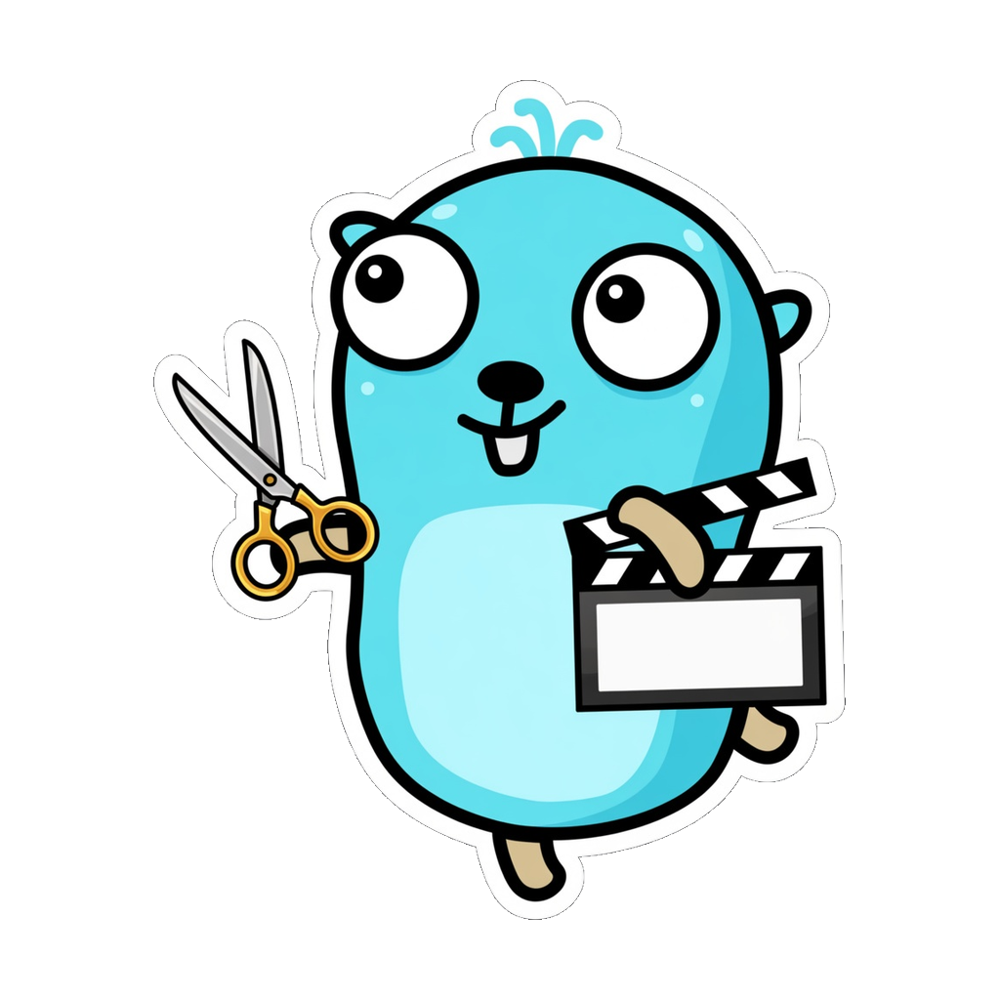

<p align="center">
  
</p>

# outtake

A clip manager for Plex libraries. Create video clips, GIFs, and screenshots from your Plex media server through an HTMX-powered web interface.

## Features

- PIN-based Plex authentication (no manual token entry)
- Video clip extraction with configurable clip profiles (CRF and encoder preset)
- GIF generation via ffmpeg palettegen pipeline
- Screenshot extraction at any timestamp
- Active Plex session monitoring
- Background job processing with real-time progress
- Single binary deployment

## Tech Stack

- **Go 1.26+** — Language
- **Fiber v3** — Web framework
- **Templ** — HTML component generation
- **HTMX** — Dynamic UI without JavaScript
- **Cobra** — CLI framework
- **Viper** — Configuration management
- **libSQL (Turso)** — Local SQLite database
- **Zerolog** — Structured logging
- **Testify + Mockery** — Testing

## Quick Start

Generated Templ files are not committed. Install [Task](https://taskfile.dev) and [templ](https://templ.guide), then:

```bash
go mod download
task templ
task test
go run . server start
```

Or build and run:

```bash
go build -o outtake .
./outtake server start
```

Other CLI commands: `outtake health`, `outtake version`. Development tasks live in `Taskfile.yml` (`task lint`, `task vet`, `task test`).

## XDG Compliance

outtake follows the [XDG Base Directory Specification](https://specifications.freedesktop.org/basedir-spec/basedir-spec.html) for default data paths:

| Variable          | Default                   | Purpose                 |
|-------------------|---------------------------|-------------------------|
| `XDG_DATA_HOME`   | `~/.local/share/outtake/` | Database + output files |
| `XDG_CONFIG_HOME` | `~/.config/outtake/`      | Reserved config path    |

The server loads defaults and `OUTTAKE_*` environment variables. It does not currently read a config file unless one is passed to `config.Load`.

## Docker

Runtime images are `scratch` with CA certs, timezone data, static ffmpeg/ffprobe, and the binary. Entrypoint is `/outtake`; default command is `server start`.

### Local image

Build from source with `build/docker/Dockerfile.dev` (repo root as context):

```bash
docker build -t outtake -f build/docker/Dockerfile.dev .
docker run -d \
  --name outtake \
  -p 8080:8080 \
  -v outtake-data:/data \
  -v /path/to/media:/media:ro \
  -e OUTTAKE_LOCAL_MEDIA_ROOT=/media \
  outtake
```

Or: `docker compose up --build`.

### Release Images

`build/docker/Dockerfile` is consumed by GoReleaser (`dockers_v2`). It copies a pre-built binary and is not a from-source build. Published images:

- `ghcr.io/papagolabs/outtake`
- `papagolabs/outtake`

```bash
docker compose -f examples/docker-compose.yaml up -d
```

### Media paths

Plex reports absolute file paths. outtake must be able to read those files, or you must set `OUTTAKE_PLEX_MEDIA_ROOT` and `OUTTAKE_LOCAL_MEDIA_ROOT` so paths are rewritten onto the container mount (typically `/media`).

## Configuration

Environment variables prefixed with `OUTTAKE_` override defaults. Viper keys use hyphens (`listen-addr`); env uses underscores (`OUTTAKE_LISTEN_ADDR`).

| Variable                   | Description                          | Default                             |
|----------------------------|--------------------------------------|-------------------------------------|
| `OUTTAKE_LISTEN_ADDR`      | Server listen address                | `0.0.0.0:8080`                      |
| `OUTTAKE_DATABASE_PATH`    | Path to SQLite database              | `~/.local/share/outtake/outtake.db` |
| `OUTTAKE_STORAGE_PATH`     | Path for output files                | `~/.local/share/outtake/output`     |
| `OUTTAKE_LOG_LEVEL`        | Log level (debug/info/warn/error)    | `info`                              |
| `OUTTAKE_ENV`              | Environment (production/development) | `production`                        |
| `OUTTAKE_FFMPEG_PATH`      | Path to ffmpeg binary                | `ffmpeg`                            |
| `OUTTAKE_FFPROBE_PATH`     | Path to ffprobe binary               | `ffprobe`                           |
| `OUTTAKE_PUBLIC_BASE_URL`  | Public URL for Plex PIN callbacks    | derived from `OUTTAKE_LISTEN_ADDR`  |
| `OUTTAKE_PLEX_SERVER_URL`  | Optional Plex Media Server URL       | unset                               |
| `OUTTAKE_PLEX_TOKEN`       | Optional Plex token                  | unset                               |
| `OUTTAKE_PLEX_CLIENT_ID`   | Plex client identifier               | generated if unset                  |
| `OUTTAKE_PLEX_MEDIA_ROOT`  | Plex filesystem prefix to remap      | unset                               |
| `OUTTAKE_LOCAL_MEDIA_ROOT` | Local prefix replacing Plex root     | unset                               |
| `OUTTAKE_SESSION_POLL_SEC` | Plex session poll interval           | `10`                                |
| `OUTTAKE_NUM_WORKERS`      | Clip job workers                     | `2`                                 |
| `OUTTAKE_MAX_CLIP_DUR_SEC` | Maximum clip duration                | `600`                               |

## License

AGPLv3
