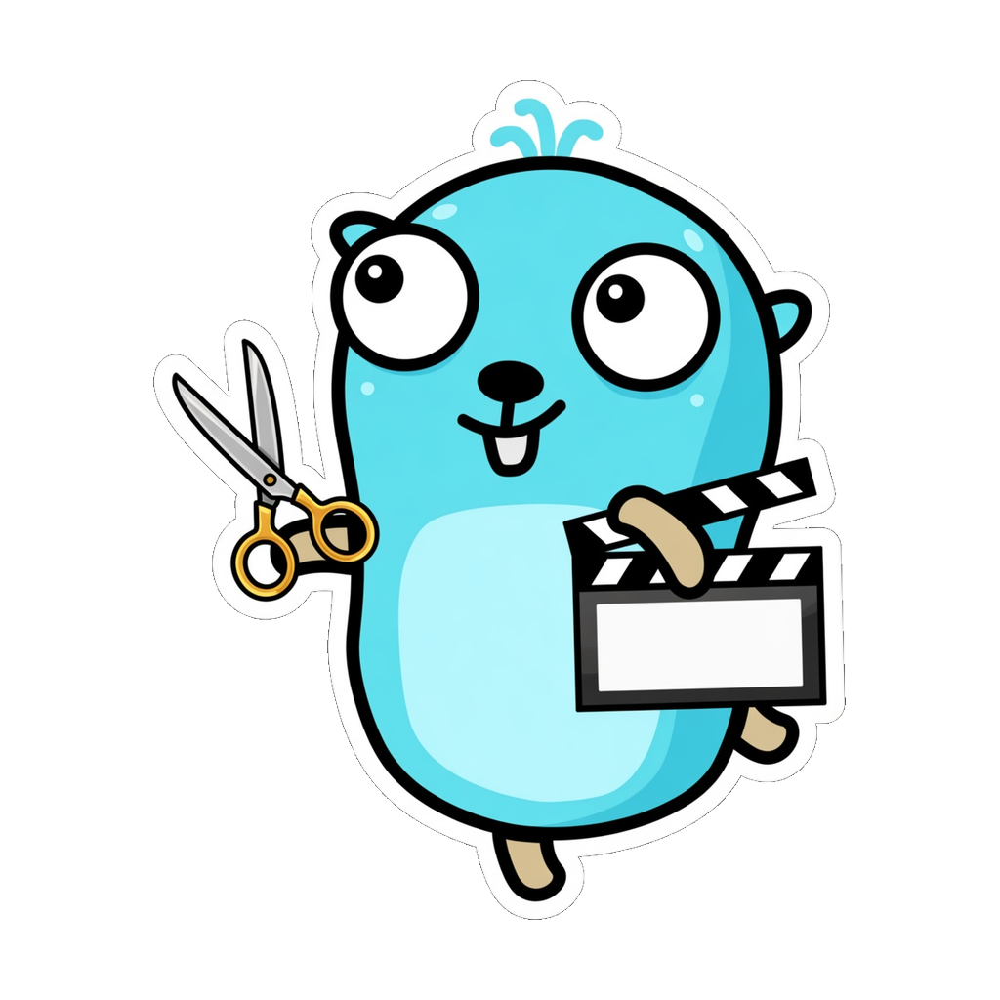
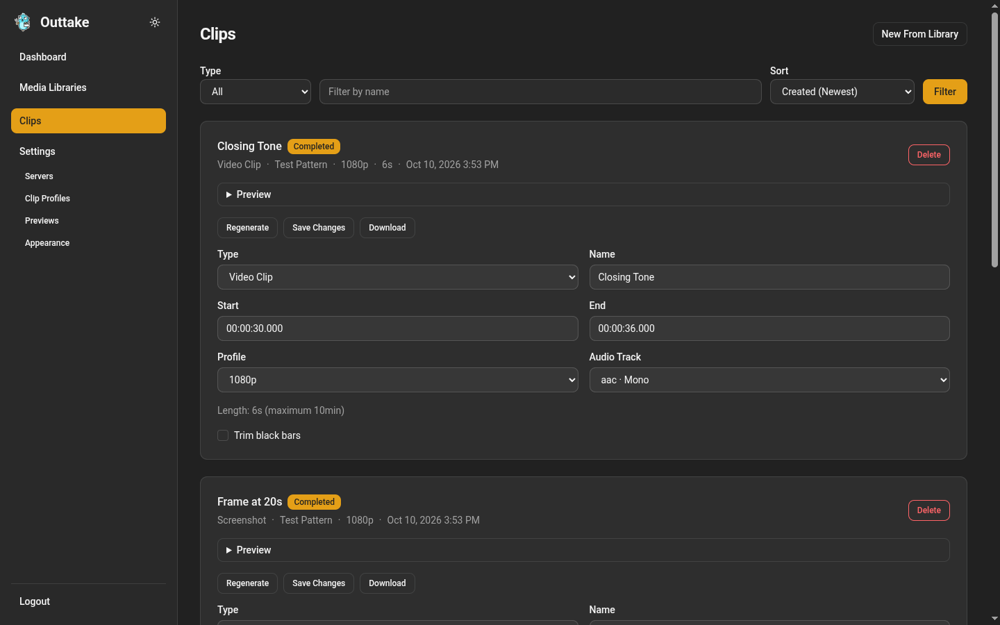
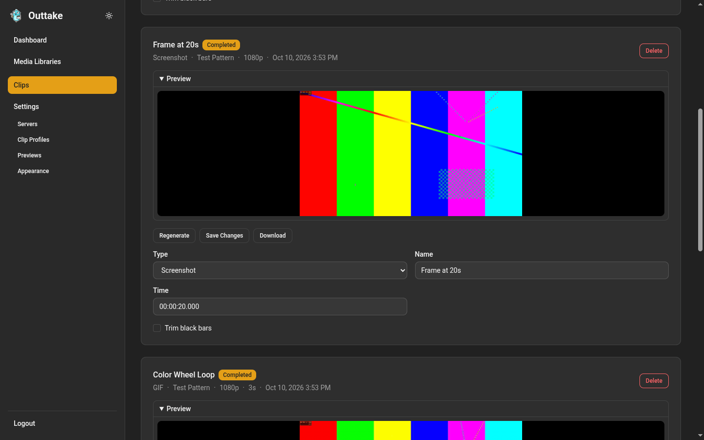
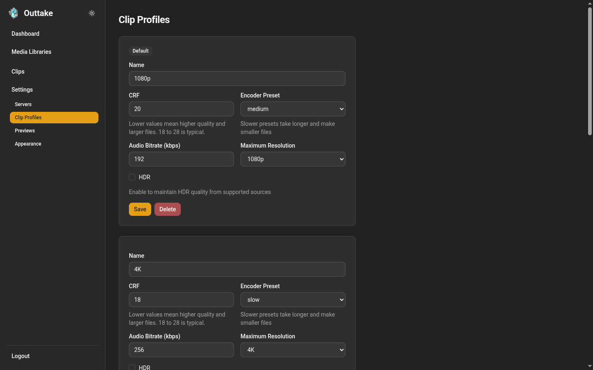
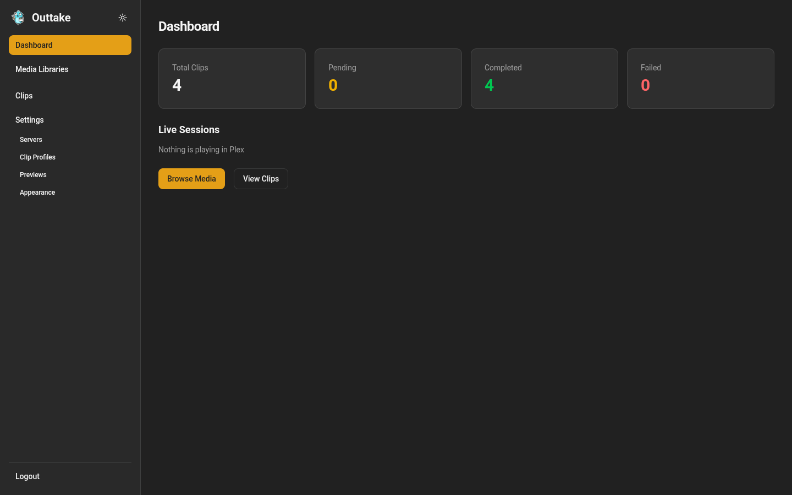
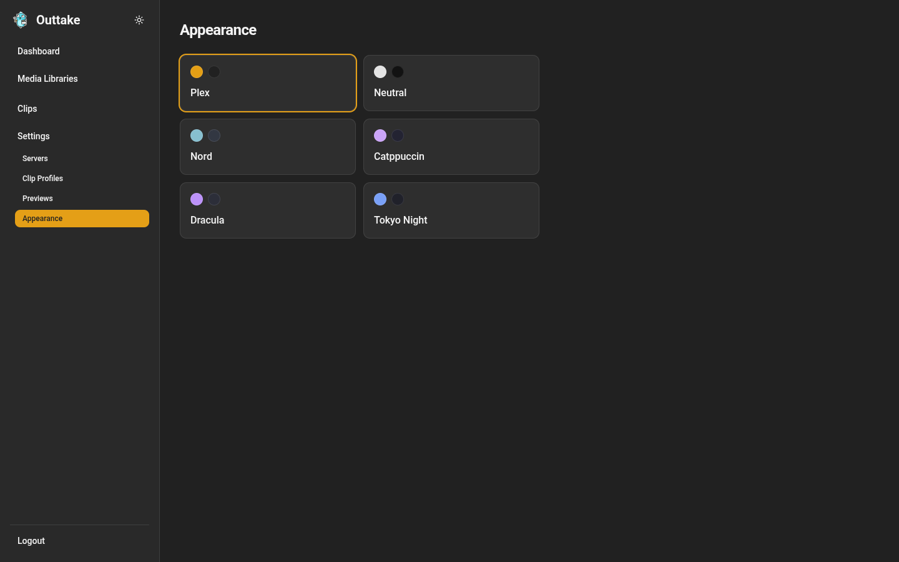

<!-- markdownlint-disable -->
<div align="center">
  <a href="https://github.com/PapagoLabs/outtake">
    
  </a>

# Outtake

  A web app that cuts video clips, GIFs, and screenshots from your Plex libraries.<br/><br/>

  [](https://go.dev/)
  [](https://github.com/PapagoLabs/outtake/actions/workflows/test.yaml)
  [](https://github.com/PapagoLabs/outtake/actions/workflows/lint-go.yaml)
  [](https://hub.docker.com/r/papagolabs/outtake)
  [](https://github.com/PapagoLabs/outtake/pkgs/container/outtake)
  [](LICENSE)
</div>
<!-- markdownlint-restore -->



Outtake is a self-hosted web app for the media in your Plex libraries. Log in with Plex, open a title, mark where the clip starts and ends, and download a video clip, GIF, or screenshot.

**Documentation: [outtake.papagolabs.com](https://outtake.papagolabs.com/)**

## What it does

- Log in with Plex, or paste a token.
- Browse libraries, search titles, and open an item.
- Mark the start and end from live Plex playback, or type the times yourself.
- Export a video clip, GIF, or screenshot, then preview and download it.
- Keep named clip profiles for the quality, encoder preset, audio bitrate, maximum resolution, and whether HDR is kept, and optionally trim black bars on each export.
- Keep HDR in 10-bit HEVC for phones, Apple devices, and YouTube, or tone-map it to SDR for everywhere else.

| | |
| --- | --- |
|  |  |
|  |  |

## Quick start

Outtake needs a Plex Media Server it can reach and read access to the media files Plex plays. The image ships FFmpeg. Save this as `docker-compose.yaml`:

```yaml
services:
  outtake:
    image: ghcr.io/papagolabs/outtake:latest
    container_name: outtake
    ports:
      - "8080:8080"
    volumes:
      - outtake-data:/data
      - ${OUTTAKE_MEDIA_PATH:-/path/to/your/media}:/media:ro
    environment:
      OUTTAKE_LOG_LEVEL: info
      OUTTAKE_LISTEN_ADDR: 0.0.0.0:8080
      OUTTAKE_PUBLIC_BASE_URL: ${OUTTAKE_PUBLIC_BASE_URL:-http://localhost:8080}
      OUTTAKE_PLEX_MEDIA_ROOT: ${OUTTAKE_PLEX_MEDIA_ROOT:-}
      OUTTAKE_LOCAL_MEDIA_ROOT: ${OUTTAKE_LOCAL_MEDIA_ROOT:-/media}
    restart: unless-stopped

volumes:
  outtake-data:
```

Point `OUTTAKE_MEDIA_PATH` at the directory that holds the files Plex plays, then start it:

```bash
export OUTTAKE_MEDIA_PATH=/path/to/your/media
docker compose up -d
```

Open [http://localhost:8080](http://localhost:8080) and choose **Login With Plex**. The first Plex account to log in owns Outtake.

## Documentation

- [Setup](https://outtake.papagolabs.com/setup/): installing Outtake and configuring it
  - [Install](https://outtake.papagolabs.com/setup/install/): Docker Compose, Docker, a build from source, or a host binary
  - [Configuration](https://outtake.papagolabs.com/setup/configuration/): every `OUTTAKE_` variable, media paths, and host names
  - [Storage and Databases](https://outtake.papagolabs.com/setup/storage/): files, S3, SQLite, and Postgres
  - [Kubernetes](https://outtake.papagolabs.com/setup/kubernetes/): example manifests and an example Helm chart
- [Guide](https://outtake.papagolabs.com/guide/): using Outtake once it is running
  - [Logging In and Servers](https://outtake.papagolabs.com/guide/logging-in/): the owner account and the server Outtake uses
  - [Making Clips](https://outtake.papagolabs.com/guide/making-clips/): marking a selection, exporting it, and managing clips
  - [Profiles and Settings](https://outtake.papagolabs.com/guide/profiles/): quality, size, HDR, previews, and appearance
  - [HDR and Playback](https://outtake.papagolabs.com/guide/hdr/): when clips keep HDR and what your browser plays
- [Troubleshooting](https://outtake.papagolabs.com/troubleshooting/): fixes for common problems and how to report one
- [CLI Reference](https://outtake.papagolabs.com/cli-reference/): every command and flag

The site's source is under [`docs/`](docs/).

## License

Outtake is licensed under the [GNU Affero General Public License v3.0](LICENSE).

## Contributing

Development commands and repo conventions live in [AGENTS.md](AGENTS.md).
